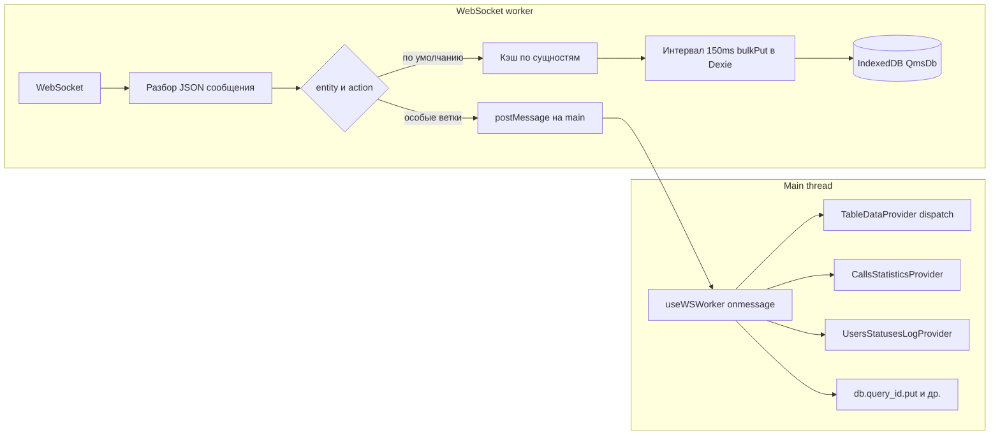

# Архитектура стейта: IndexedDB, WebSocket worker и React-контексты

## Назначение папки `queue-manager-state-architecture`

Каталог `mirror/src` — справочный **срез исходников** основного приложения (IndexedDB, worker, хуки и провайдеры), пути импортов в файлах те же, что в монорепозитории (`app/…`, `hooks/…`, `shared/…`). Сборка только из `mirror` не настроена: нужны алиасы TypeScript/Vite и остальной код проекта.

Оригинальные файлы в репозитории лежат под `src/` в корне UI-проекта; ниже описана их логика и связи.

---

## Краткий обзор

В приложении **нет одного универсального источника правды** для всех сущностей. Данные живут так:

- **Dexie (IndexedDB), синглтон `db`** — долговременное хранилище большинства сущностей, в т.ч. то, что приходит по WebSocket и сбрасывается из worker через кэш и `bulkPut`.
- **React state в контекстах** — оперативная память для части таблиц и агрегатов: пагинированные таблицы (`TableDataProvider`), статистика звонков (`CallsStatisticsProvider`), журнал статусов пользователей (`UsersStatusesLogProvider`).

Куда попадёт сообщение WS, решает **ветвление по `entity` в `wsWorker.ts`**: часть сущностей только уходит в UI через `postMessage`, часть пишется в IndexedDB, часть — и туда, и в UI.

---

## Поток данных (WebSocket → worker → UI / IndexedDB)

---

## `QmsDb` и `db` (`src/app/db.ts`)

- Один класс **Dexie** с именем БД `QmsDb`, версия схемы задаётся в `version(N).stores({ ... })`.
- Каждое поле класса (`calls`, `users`, `permissions`, …) — таблица; **имя свойства должно совпадать** со строкой `entity` в WS-сообщениях и с константами `ENTITY_NAMES` в `constants/settings.ts`, иначе в worker выражение `db[entity]` окажется некорректным.
- Экспорт **`export const db = new QmsDb()`** — единственный экземпляр; им пользуются и главный поток (`useLiveQuery`, прямые запросы), и worker (в этом проекте Dexie подключён и в worker — см. импорты в `wsWorker.ts`).

---

## `wsWorker.ts`: кэш, сброс в IndexedDB, особые ветки

### Общая механика

- **Один** модульный `WebSocket` на воркер; счётчики реконнектов и флаги — на уровне модуля.
- При `onopen` запускается **`setInterval` 150 ms**: снимается снимок `cache`, `cache` обнуляется, для каждой сущности с непустым набором значений вызывается **`db[entity].bulkPut(items)`**. При ошибке `bulkPut` данные сущности **мержатся обратно** в текущий `cache`, чтобы не потерять батч.
- Для операций **`put` / `add` / `bulkPut` / `bulkAdd`** в рамках кэшируемого пути данные **складываются в in-memory объект** по первичному ключу таблицы (`schema.primKey.name`), а не сразу в Dexie для каждой операции.
- Для других действий и когда кэш уже есть, вызывается **`db[entity]?.[action](payload)`** напрямую (в зависимости от ветки `updateCache` / `updateCacheData`).

### Особые ветки по `entity` (важно для онбординга)

| Поведение | Сущности / случаи |
|-----------|-------------------|
| Только `postMessage` в main как `TABLE_DATA_MESSAGE`, **без** `updateCache` для этих WS-сообщений | `calls`, `operator_status_history` — пагинация/таблица обновляется в **React**, а не через описанный выше flush в IndexedDB из worker |
| Фильтрация payload | `calls_statistics`: при `bulkPut` отбрасываются записи старше **24 часов** от `Date.now()`; затем сообщение уходит в main как `CALLS_STATISTICS` |
| Отдельно в main, плюс кэш/БД по сущности | `notification`, `notification_sos` — уведомления в UI + `updateCache` |
| Нормализация пользователей | `users`: для `put` / `bulkPut` / `add` вызывается `normalizeUserStatus` |
| Сброс таблиц перед записью | `organization_structure` — `db.notification.clear()`, payload через `normalizePayload`; `abonent` — `db.abonent.clear()` |
| `delete` без кэша | `company_runtime` + `action === 'delete'` — `db.company_runtime.delete(company_id)` |
| Прокси REST | `rotator` — `PROXY_REST_API` с `payload` для сопоставления Promise в `useWSWorker` |
| Подтверждение запроса | `query_id` — `QUERY_ID_ACK` + запись в `db` на main в `useWSWorker` |
| Только рассылка в main | `users_statuses_log` — `USERS_STATUSES_LOG` |

Любая сущность, не попавшая в `switch`, обрабатывается в **`default`** через `updateCache` (типичный путь в IndexedDB через кэш).

---

## `useWSWorker` (`src/hooks/useWSWorker.ts`)

- Создаёт worker через **`new WSWorker()`** (Vite: `?worker`).
- На **`OPEN` / `CLOSE` / MAX_RECONNECTS** обновляет локальный React state строки `status` и флага.
- **`TABLE_DATA_MESSAGE`** → `dispatch` из `useTableDataContext()`.
- **`CALLS_STATISTICS`**, **`USERS_STATUSES_LOG`** → соответствующие `dispatch` из провайдеров.
- **`QUERY_ID_ACK`** → `db.query_id.put(data)`.
- **`NOTIFY` / `SOS_NOTIFY`** → глобальные обработчики уведомлений.
- **`PROXY_REST_API`**: по `id` запроса находится Promise в `pendingRequestsRef`, resolve/reject по HTTP `status`.

### Нюанс

На каждый **`OPEN`** вешается **`beforeunload`** с отправкой `DISCONNECT` в worker, **без** снятия предыдущего слушателя при повторных подключениях — при многократных реконнектах возможны лишние слушатели.

---

## Порядок провайдеров (`src/app/App.tsx`)

Инвариант: **`WebSocketProvider` должен быть вложен внутрь** провайдеров, чьи хуки вызываются из **`useWSWorker`**:

- `TableDataProvider`
- `CallsStatisticsProvider`
- `UsersStatusesLogProvider`

Иначе `useTableDataContext` / `useCallsStatistics` / `useUsersStatusesLog` внутри `useWSWorker` окажутся **вне контекста** и упадут или получат неверное состояние.

`PermissionsProvider` и `SystemLoggerProvider` обёрнуты **снаружи**; к `useWSWorker` они не подключаются напрямую.

---

## `TableDataProvider`: табличный стейт из WS

- **Состояние**: `useReducer(tableDataReducer, tableDataInitialState)`.
- **Сущности** ограничены типом `TableDataEntityNames` / ключами `TableDataState`: `calls`, `operator_status_history`, `company`, `strategy_call`, `selection`, `abonents_lists` (см. `types/settings.ts` и `model/types.ts`).
- **Действия**: `bulkPut` (страница + мета пагинации + `items`), `put` (элемент наверх списка или замена по `id`), `add`, `delete`, `query` (только `isLoading: true`).

### Нюанс типов полей времени

В начальном состоянии используется **`updatedAt`**, в reducer при обновлениях выставляется **`updatedDate`** — поля с разными именами; при использовании «времени обновления» в UI нужно понимать, какое поле реально заполняется.

---

## `CallsStatisticsProvider` и `UsersStatusesLogProvider`

- Редьюсер: **`createEntityReducer<T>()`** (`src/utils/createEntityReducer.ts`), состояние — **`Map<T['id'], T>`**, наружу отдаётся массив `Array.from(state.values())`.
- Поддерживаемые `action`: `put`, `add`, `delete`, `bulkPut`, `bulkAdd` (см. `WebSocketActions`).
- **`query`** в этом редукторе **не обрабатывается** — сообщение с таким `action` не менит Map.

---

## Permissions (`PermissionsProvider` + `usePermissions`)

- Контекст отдаёт **`permissions: string[]`**.
- **`usePermissions`** использует **`useLiveQuery`** (dexie-react-hooks): читает `current_user`, затем `users`, затем `roles` по заголовкам ролей пользователя, **объединяет** объекты прав из ролей (логическое ИЛИ по флагам), возвращает отсортированный список ключей.
- Обновление прав **привязано к данным в IndexedDB** (`users`, `roles`, `current_user`), а не к отдельному WS-событию в этом хуке: сначала данные должны оказаться в `db` через worker/прочие пути.

---

## `useEntityTableData`

Обёртка над **`tableData[entityName]`**: возвращает `items` и объект пагинации (`size`, `page`, `pages`, `total`) для типобезопасного ключа сущности таблицы.

---

## Две модели данных для «звонков» (`calls`)

- Таблицы/хуки, завязанные на **`TableDataProvider` / `useEntityTableData`**, получают обновления по **`TABLE_DATA_MESSAGE`** из worker (ветка `calls` **не** пишет эти же WS-апдейты в IndexedDB через описанный flush).
- Компоненты, которые читают **`db.calls`** через **`useLiveQuery`**, зависят от **другого** наполнения IndexedDB (начальная загрузка, другие команды, иные ветки) — это **не тот же поток**, что пагинированная таблица из контекста.

При анализе багов важно проверить, **какой именно источник** использует экран.

---

## Сводка: где живёт актуальное состояние

| Область | IndexedDB (`db`) | React context |
|---------|------------------|---------------|
| Большинство сущностей по WS (`default` в worker) | Да (кэш + bulkPut / прямые вызовы) | Обычно нет |
| `calls`, `operator_status_history` (пагинация в таблицах из `TableDataProvider`) | Не через эту WS-ветку | Да (`TableDataProvider`) |
| `calls_statistics` | Может дублироваться логикой приложения; WS идёт в reducer | Да (`CallsStatisticsProvider`) |
| `users_statuses_log` | Зависит от остального кода | Да (`UsersStatusesLogProvider` с WS) |
| Права доступа | Да (`users`, `roles`, `current_user`) | Да (`permissions[]` в контексте) |
| `query_id` | Да (`db.query_id.put` на main) | Нет |

---

## Карта файлов в `mirror/src`

Для быстрого чтения кода рядом с этой документацией:

- `app/db.ts` — схема Dexie
- `app/workers/wsWorker.ts` — сокет, кэш, ветвление по `entity`
- `app/workers/types/*`, `normalizePayload.ts`, `utils/normalizeUserStatus.ts`
- `hooks/useWSWorker.ts` — мост worker ↔ React ↔ `db`
- `hooks/usePermissions.ts`, `app/providers/PermissionsProvider/*`
- `app/providers/TableDataProvider/*`
- `app/providers/CallsStatisticsProvider/*`, `UsersStatusesLogProvider/*`
- `app/providers/WebSocketProvider/*`
- `utils/createEntityReducer.ts`
- `hooks/useEntityTableData.ts`
- `app/App.tsx` — порядок провайдеров
