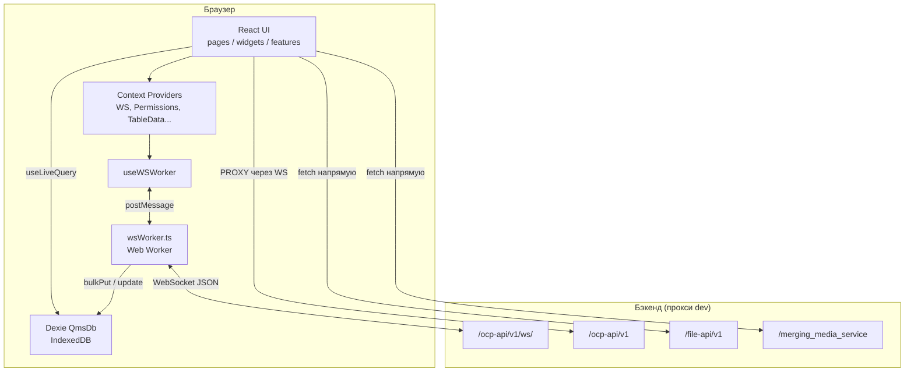
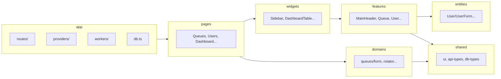

# Архитектура

## Назначение системы

Веб-клиент **Queue Manager (OCP)** для супервизоров и администраторов контакт-центра: очереди, пользователи, исходящие кампании, дашборд операторов, звонки, роли, скиллгруппы, обратные звонки, интеграции (SoftPhone, Superset, Webim, внешние приложения).

## Высокоуровневая диаграмма



## Слои приложения (Feature-Sliced Design)



### Правила импортов (де-факто)

| Слой | Может импортировать |
|------|---------------------|
| `app` | всё ниже |
| `pages` | widgets, features, entities, shared, domains, hooks, utils |
| `widgets` | features, entities, shared, hooks |
| `features` | entities, shared |
| `entities` | shared |
| `shared` | только shared |
| `domains` | shared, types, constants (крупные доменные формы) |

Нарушения встречаются (импорты из `pages` в `shared/db-types`) — не считать строгим FSD.

## Дерево провайдеров (`App.tsx`)

Порядок снизу вверх (внешний → внутренний):

```
PermissionsProvider
  SystemLoggerProvider
    TableDataProvider
      CallsStatisticsProvider
        UsersStatusesLogProvider
          WebSocketProvider
            HelpCenterProvider
              UserSettingsProvider
                RouterProvider + глобальные виджеты
```

Глобальные overlay-компоненты (вне роутера): `NewVersionOverlay`, `SystemLogger`, `CampaignEvent`, `CallEvents`, `DataChannel`, `SoftPhone`, `DialogScript`, `WebimChatModal`.

## Роутинг

- `createBrowserRouter` в `src/app/routes/router.tsx`
- Обёртки: `MainContext` → `PrivateRoute` (проверка `sid`) → `Layout` (Sidebar + Header)
- Страницы: **lazy** через `src/pages/index.ts` (`createLazyPage`)
- Пути: `src/app/routes/paths.tsx`, меню: `src/app/routes/routes.tsx` + `permissionKey`

## Ключевые технические решения

| Решение | Зачем |
|---------|--------|
| Web Worker для WS | Не блокировать main thread; батч-запись в IndexedDB каждые 150ms |
| Dexie + `useLiveQuery` | Реактивный UI без Redux; офлайн-кэш сущностей |
| OpenAPI codegen | Типы моделей в `src/shared/api-types` (`yarn gen:client`) |
| PrimeReact | UI-kit (таблицы, формы, диалоги) |
| Formik + Yup | Формы и валидация |

## Внешние runtime-зависимости

- **SoftPhone** — `/softphone/softphone-1.0.0-beta.js` в `index.html`
- **Superset** — встроенная аналитика (`@superset-ui/embedded-sdk`), токен через `REACT_APP_SUPERSET_HOST`
- **Webim** — iframe cookies + `WebimChatModal`
- **externalScripts/** — Ucell operator card, ticket connection table (копируются в build через Vite)
