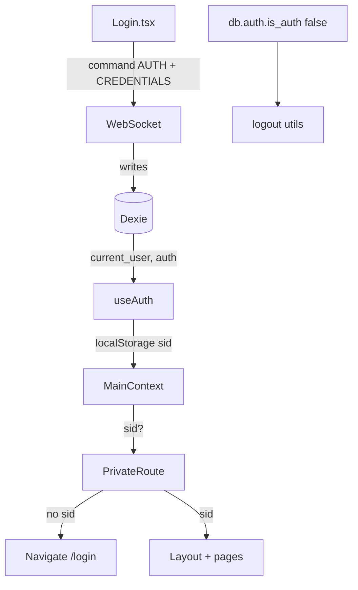

# Авторизация и права

## Сессия



### Хранение

- `localStorage.sid` — session id
- `db.current_user` — пользователь после auth
- `db.auth` — `{ is_auth: boolean }`; `useEffect` в `MainContext` вызывает `logout()` если `!is_auth`

### Логин

`src/pages/Login/Login.tsx`:

1. `command(AUTH, CREDENTIALS, { login, pwd })` — login в lower case
2. Ошибка — через `db.notification` (type `error`)
3. Успех — `sid` в context → redirect на `url-history` или `/`

### PrivateRoute

Только проверка наличия `sid` в outlet context. **Не проверяет permissions** на уровне роутера.

## Права (RBAC)

### Источник

`usePermissions` (`hooks/usePermissions.ts`):

1. `db.current_user` → `db.users.get(id)`
2. Роли пользователя → `db.roles.where('title').anyOf(user.roles)`
3. Merge `permissions` объектов ролей (OR по ключам)
4. Возврат: `string[]` ключей прав

### Использование в UI

```typescript
const { permissions } = usePermissionsContext();
const canView = permissions.includes('VIEW_SETTINGS');
```

Меню (`app/routes/routes.tsx`): каждый пункт имеет `permissionKey` — Sidebar фильтрует маршруты.

### Примеры ключей

| Ключ | Область |
|------|---------|
| `LIST_QUEUES` | Очереди |
| `LIST_USERS` | Пользователи |
| `VIEW_DASHBOARDS` | Дашборд |
| `VIEW_CALLS`, `LISTEN_CALL`, `UPDATE_CALLS` | Звонки (иерархия OWN/SUBORDINATES/ALL) |
| `VIEW_OUTGOING_CALLS` | Исходящий обзвон |
| `VIEW_ROLES`, `VIEW_ACCESSES` | Администрирование |

Полное дерево прав — UI `widgets/TreeAccesses`, сверка с сервером: `utils/comparePermissions.ts`.

### Важно для агентов

- Права **не enforced** на роутере — только скрытие UI. Прямой URL может открыть страницу без права (бэкенд должен отклонять операции).
- Ключи — **строковые константы**, централизованного enum нет; искать по `permissions.includes('...')`.

## Операторские статусы

Команды WS: `change_status_to_ready`, `change_status_to_break`, `change_status_to_logout`.

История: `users_statuses_log` → `UsersStatusesLogProvider`.

## Блокировка пользователя

`BLOCK_USER` / `UNBLOCK_USER` через `command`.
