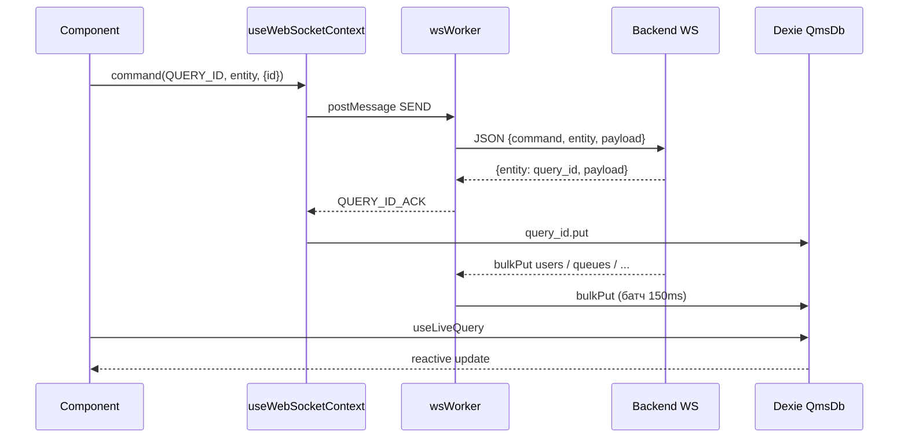

# Поток данных

## Общая схема



## WebSocket API

### URL

- Prod/стенд: относительный `/ocp-api/v1/ws/`
- Dev: прокси Vite → `VITE_PROXY_OCP_API` (`vite.config.proxy.ts`)

### Отправка команд (main thread)

`useWSWorker` → `worker.postMessage({ type: 'SEND', data: { command, entity, type, payload } })`

`type` = `` `${command}_${entity}` `` (соглашение с бэкендом).

### Команды (`constants/api.ts` → `COMMAND_NAMES`)

| Команда | Назначение |
|---------|------------|
| `auth` | Логин |
| `query` / `query_id` | Загрузка сущностей (с ack по id) |
| `create`, `update`, `delete` | CRUD |
| `bulk_*`, `bulkPut` | Массовые операции |
| `proxy` | REST через WS (см. ниже) |
| `logout`, `change_status_to_*` | Оператор/сессия |
| `campaign_action`, `start_callback` | Кампании, коллбэки |

### Сущности (`constants/settings.ts` → `ENTITY_NAMES`)

Имя таблицы Dexie ≈ `entity` в WS (например `users`, `queues`, `company`). Полный список — ~80 ключей в `ENTITY_NAMES` и `QmsDb` (`app/db.ts`).

## Web Worker (`app/workers/wsWorker.ts`)

### Ответственность

- Держит `WebSocket`
- Парсит входящие `{ entity, action, payload }`
- Пишет в IndexedDB (`bulkPut`, `put`, `delete`, …)
- Батч-кэш: накопление `put`/`bulkPut` → flush в Dexie **каждые 150ms**
- Reconnect: до **12** попыток, интервал 5s → `MAX_RECONNECTS_REACHED`

### Специальные entity в worker

| Entity | Поведение |
|--------|-----------|
| `notification` | `NOTIFY` → UI toast |
| `notification_sos` | `SOS_NOTIFY` |
| `query_id` | `QUERY_ID_ACK` → снятие loading в `useDataQuery` |
| `calls`, `operator_status_history` | `TABLE_DATA_MESSAGE` → `TableDataProvider` |
| `calls_statistics` | фильтр 24ч → `CallsStatisticsProvider` |
| `users_statuses_log` | `UsersStatusesLogProvider` |
| `rotator` | `PROXY_REST_API` (ответ REST-прокси) |
| `abonent` | `db.abonent.clear()` перед записью |
| `users` | нормализация статуса (`normalizeUserStatus`) |

## IndexedDB (`app/db.ts`)

- Класс `QmsDb extends Dexie`, версия схемы **67**
- Экспорт: `export const db = new QmsDb()`
- Типы: OpenAPI-модели (`shared/api-types`) + локальные (`shared/db-types`, `types/`)

### Важные таблицы

| Таблица | Назначение |
|---------|------------|
| `auth` | Флаг `is_auth` — при `false` → logout |
| `current_user` | SID, id — сессия |
| `users`, `roles`, `permissions` | Пользователи и RBAC |
| `queues`, `company`, `calls` | Бизнес-сущности |
| `query_id` | Ack загрузки по `useDataQuery` |
| `notification` | Ошибки логина и системные уведомления |
| `user_settings` | Настройки UI пользователя |
| `calls_statistics` | Поток статистики для дашборда |

## Загрузка данных на странице

Типичный паттерн:

```typescript
// 1. Триггер запроса при открытом WS
useDataQuery(ENTITY_NAMES.USERS, { isPayload: true, payload: {...} });

// 2. Чтение из Dexie
const users = useLiveQuery(() => db.users.toArray());

// 3. Мутации
command(COMMAND_NAMES.UPDATE, ENTITY_NAMES.USERS, payload);
```

`useDataQuery` ждёт `wsStatus === 'Open'`, шлёт `query_id`, снимает `isLoading` при появлении записи в `db.query_id`.

## REST через WebSocket (PROXY)

`sendRestApiMessage(command, entity, { method, path, body })` — Promise с `id` в payload; ответ приходит как `PROXY_REST_API` с тем же `id`.

`sendRotatorMessage` — обёртка: `PROXY` + entity `rotator`.

Используется там, где REST не вызывается напрямую (ротатор, часть dashboard-действий).

## Прямой REST (fetch)

Обход WS для файлов и медиа:

| Prefix | Примеры |
|--------|---------|
| `FILE_API_PREFIX` | стрим записи звонка, ext apps, FTP validate |
| `MERGE_MEDIA_API_PREFIX` | screen recording jobs/files |
| `OCP_API_PREFIX` | streaming dashboard, company_logs |
| `SUPERSET_HOST` | `/get-token/` |

## TableDataProvider

Отдельный reducer для **потоковых табличных** WS-сообщений (`calls`, `operator_status_history`) — не пишет сразу в общий Dexie-поток UI, а диспатчит в контекст таблицы.

## Версионирование приложения

`useValidateVersion` / `NewVersionOverlay` — `fetch('/version')`, принудительное обновление при смене билда.
