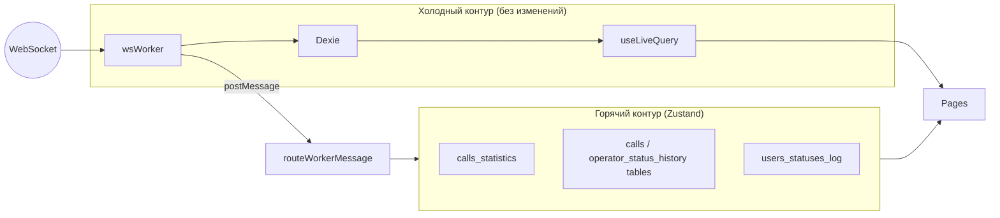
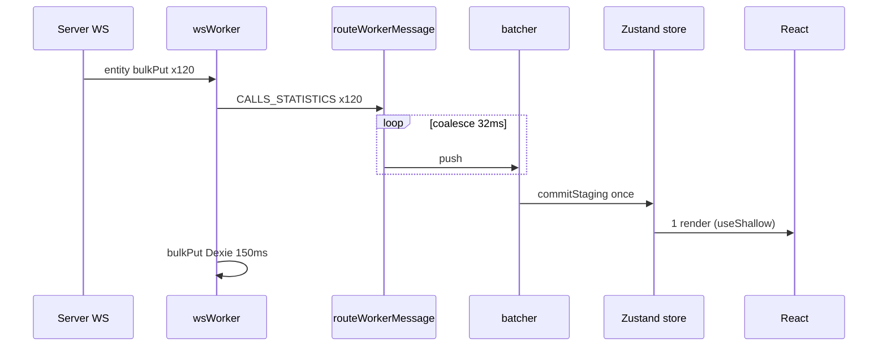

# Архитектура `app/state`

## Задача

Убрать «матрёшку» из 7 React Context-провайдеров и выдержать **100+ WS-сообщений/сек** без лавины ререндеров, не ломая Dexie и `wsWorker`.

## Принципы

### 1. Два контура данных

| Контур | Хранение | Частота | UI |
|--------|----------|---------|-----|
| Холодный | IndexedDB | средняя | `useLiveQuery` |
| Горячий | Zustand in-memory | 100+/с | `useShallow` + `revision` |

### 2. Immediate vs batched

**Сразу** (latency-critical):

- `OPEN` / `CLOSE` / `MAX_RECONNECTS_REACHED`
- `QUERY_ID_ACK` → `db.query_id`
- `NOTIFY` / `SOS_NOTIFY`
- `PROXY_REST_API` → Promise resolve

**Батч** (throughput-critical):

- `CALLS_STATISTICS` — flush 32ms, coalesce по id
- `USERS_STATUSES_LOG` — flush 32ms
- `TABLE_DATA_MESSAGE` — flush 48ms, `bulkPut` побеждает deltas

### 3. Coalescing

В окне flush для одного `entity+action+id` побеждает **последнее** сообщение. `bulkPut` сбрасывает накопленные deltas для entity.

### 4. Ограничение очереди

`MAX_BATCH_QUEUE_SIZE = 2000` — принудительный flush при burst, защита от OOM.

## Уязвимости текущей архитектуры → как закрыто

| Риск | Было | Стало |
|------|------|--------|
| 100+ dispatch/s → 100+ React commits | Context `useReducer` | 1 commit / 32ms на store |
| Provider order | `useWSWorker` внутри 3 providers | `routeWorkerMessage` → stores напрямую |
| Двойной источник calls_statistics | worker filter 24h + reducer | тот же filter в `enqueueCallsStatisticsMessage` |
| PROXY race | ref Map в hook | `wsStore.pendingRequests` |
| sid в Outlet + localStorage | MainContext | `sessionStore` (persist, миграция опциональна) |

## Что намеренно НЕ трогаем

- `app/workers/wsWorker.ts` — батч Dexie 150ms
- `app/db.ts` — схема v67
- OpenAPI типы
- Permissions из Dexie (`usePermissions`) — отдельная фаза

## Производительность (оценка)

При 150 msg/s и flush 32ms:

- ~5 store commits/s вместо 150 reducer/s
- Coalescing сжимает put по одному id до 1 операции за кадр
- Компоненты подписаны через `useShallow` на массивы — меньше лишних ререндеров

## Файлы

| Модуль | Роль |
|--------|------|
| `core/batchScheduler.ts` | Очередь + rAF/setTimeout flush |
| `core/entityMapApply.ts` | Map-mutate без clone на каждое msg |
| `core/tableDataApply.ts` | Порт reducer таблиц + batch apply |
| `stores/*Store.ts` | Слайсы Zustand |
| `bridge/routeWorkerMessage.ts` | Единый switch worker events |
| `bridge/WsBridge.tsx` | Mount worker, lifecycle |
| `hooks/useWs.ts` | Совместимость с `useWebSocketContext` |

## Диаграмма потока сообщения

