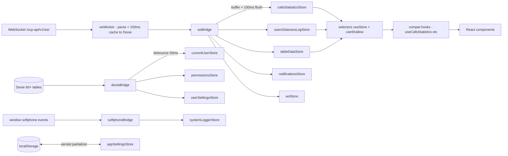

# zustand-arch — reference state layer

Self-contained reference implementation of the target Zustand-based state layer for `queue-manager-ui`. The module is shipped in its own folder so engineers can study it end-to-end before copying chunks into `src/app/stores/` per the migration checklist. No file outside this folder is modified by this reference.

The design is driven by two documents in this repository:

- [`queue-architect/docs/architecture.md`](queue-architect/docs/architecture.md) — current data-flow architecture.
- [`queue-architect/docs/zustand-migration-proposal.md`](queue-architect/docs/zustand-migration-proposal.md) — target architecture and migration plan.

## Target architecture



## Folder layout

```
zustand-arch/
  README.md                       this file
  package.snippet.json            deps to merge into root package.json
  tsconfig.json                   extends root, strict noImplicitAny
  src/
    index.ts                      public barrel
    bootstrap/
      initStores.ts               wires wsBridge + dexieBridge + softphoneBridge
      initStores.docs.md
    bridges/
      wsBridge.ts                 worker -> stores (100ms batcher)
      wsBridge.types.ts
      dexieBridge.ts              dexie hooks -> derived stores (50ms debounce)
      softphoneBridge.ts          window events -> systemLoggerStore
    stores/
      wsStore.ts                  status, pending, command API
      callsStatisticsStore.ts     hot byId+byQueue+version
      usersStatusesLogStore.ts    hot byId+byUser+version
      tableDataStore.ts           6 entity slices + applyMessage
      notificationsStore.ts       toast + sos with TTL via setTimeout
      currentUserStore.ts
      permissionsStore.ts
      userSettingsStore.ts
      helpCenterStore.ts
      systemLoggerStore.ts
      avatarStore.ts              version Map<userId, number>
      appSettingsStore.ts         persist + partializer
    selectors/                    ready-made hooks per store
    hooks/                        compat shims that keep legacy signatures
    types/                        re-exports + local typed shapes
    middleware/
      withDevtools.ts             dev-only redux devtools wrapper
    utils/
      createBatcher.ts
      shallowEqualMap.ts
      stableArrayFromMap.ts
  docs/
    migration-checklist.md
    perf-budget.md
    mapping.md
```

## How to use this module

1. Read both source documents in full.
2. Skim [`src/index.ts`](src/index.ts) — every public symbol is listed there.
3. Inspect a representative hot store: [`src/stores/callsStatisticsStore.ts`](src/stores/callsStatisticsStore.ts) and its selectors.
4. Inspect [`src/bridges/wsBridge.ts`](src/bridges/wsBridge.ts) to see how worker messages reach stores.
5. Follow the staged plan in [`docs/migration-checklist.md`](docs/migration-checklist.md).

## How to embed into `src/`

The whole module is portable. The intended flow is:

- Copy `zustand-arch/src/stores`, `selectors`, `bridges`, `bootstrap`, `middleware`, `utils`, and `types` into a new home (e.g. `src/app/stores/`).
- Rewrite the `../../../src/...` relative imports as project-local imports (`app/db`, `shared/db-types`, `types/settings`, `constants/api`, etc.).
- Remove the compat hooks once all consumers move to selectors (see [`docs/mapping.md`](docs/mapping.md)).
- Merge [`package.snippet.json`](package.snippet.json) into the root `package.json` and reinstall.

## Performance budgets

See [`docs/perf-budget.md`](docs/perf-budget.md). Key invariants:

- One shared 100ms batcher for the hot path (max 10 flushes/sec).
- `Array.from` is invoked only by `useStableArrayFromMap` (consumer side), keyed by a monotonic `version`.
- `wsBridge` contains no React imports.
- `appSettingsStore` persist surface is locked to `{ sid, tableConfig, quickFilters, version }`.

## Dependencies

Only two runtime additions to the root project:

- `zustand@^5.0.0`
- `immer@^10.0.0`

See [`package.snippet.json`](package.snippet.json).
