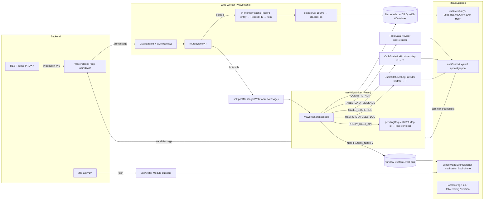

# Архитектура управления состоянием (state management)

> Анализ потоков данных, без UI-слоя. Фокус: откуда приходит, как нормализуется, где хранится, как потребляется.
> Профиль нагрузки: WebSocket, >100 сообщений/сек, единый канал на клиента.

---

## 1. Источники данных

| Источник | Путь / Файл | Назначение |
|---|---|---|
| **WebSocket** (основной) | `WS_API_URL = '/ocp-api/v1/ws/'` → `src/app/workers/wsWorker.ts` | Все доменные сущности (users, queues, calls, statistics, notifications, …), команды на сервер, PROXY REST. |
| **REST через PROXY-WS** | `useWSWorker.sendRestApiMessage` / `sendRotatorMessage` | REST-вызовы, обёрнутые в WS-сообщение `command='proxy'`. Используется для rotator, screen-recordings и пр. (`src/services/**`). Ответы коррелируются по `id` в `pendingRequestsRef`. |
| **Прямой `fetch`** | `src/hooks/useAvatar.ts`, `src/shared/ui/AudioPlayer/**`, `src/widgets/Settings/DialogueApplications/api/**` | Бинарные/медиа-ресурсы и нестандартные эндпоинты, минуя WS. |
| **LocalStorage** | `src/hooks/useAuth.ts` (`sid`), `src/utils/setTableConfig.ts`, `src/shared/ui/ReactTable/hooks/useSavedUserTableConfig.ts`, `src/hooks/useValidateVersion.ts`, `src/utils/getLocalStorageConfig.tsx`, `src/utils/quickFilters.ts` | Сессионный токен, пользовательские конфиги таблиц, версия билда, фильтры. |
| **`window` CustomEvent bus** | `src/utils/dispatchNotify.ts`, `src/utils/dispatchSosNotify.ts`, `src/utils/wsEventHandlers.ts`, softphone-события | Сквозной канал нотификаций и событий софтфона. |
| **Локальный module-bus** | `src/hooks/useAvatar.ts` (`Map<userId, Set<Listener>>`) | Инвалидация аватаров между инстансами `useAvatar`. |

---

## 2. Парсинг и нормализация входящих сообщений

Входная точка — Web Worker `src/app/workers/wsWorker.ts`.

- `ws.onmessage` → `JSON.parse(event.data)` → `ReceivedWebSocketMessage = { action, entity, payload }`.
- `switch (msg.entity)` маршрутизирует сообщение:
  - `rotator` → `broadcastMessage({ type: 'PROXY_REST_API', data: msg.payload })` (только в React, не в БД).
  - `notification` → `dispatchNotify` + `updateCache('notification', …)`.
  - `notification_sos` → `dispatchSosNotify` + `updateCache(…)`.
  - `calls_statistics` (`action === 'bulkPut'`) — фильтр окна 24 ч по `ts_start`, далее broadcast в `CallsStatisticsProvider`.
  - `users_statuses_log` → broadcast в `UsersStatusesLogProvider`.
  - `query_id` → broadcast → запись в `db.query_id` (`useDataQuery` снимает `isLoading`).
  - `organization_structure` → `db.notification.clear()` + `normalizePayload` (вытаскивает `items`/`data`/массив) + `updateCache`.
  - `abonent` → `db.abonent.clear()` перед `updateCache`.
  - `company_runtime` (`action === 'delete'`) → точечный `db.company_runtime.delete(company_id)`.
  - `calls`, `operator_status_history` → broadcast `TABLE_DATA_MESSAGE` в `TableDataProvider`.
  - `users` (`put`/`bulkPut`/`add`) → `normalizeUserStatus` (`status.reason_id ||= status.value`) → `updateCache`.
  - **default** → `updateCache(entity, action, payload)`.

### In-memory cache + батч-flush в Dexie

`wsWorker.ts` хранит `cache: Record<EntityName, { data: Record<PK, Item> }>` и каждые **150 мс** пушит в Dexie:

```45:51:src/app/workers/wsWorker.ts
  if (action === 'put' || action === 'add') {
    const entityPrimaryKey = db[entity].schema.primKey.name;
    if (entityPrimaryKey in payload) {
      cache[entity].data[payload[entityPrimaryKey]] = payload;
    }
```

```85:133:src/app/workers/wsWorker.ts
    updateCacheInterval = setInterval(async () => {
      const isCacheEmpty = Object.getOwnPropertyNames(cache).length === 0;
      if (isCacheEmpty) return;

      const entities = Object.keys(cache);

      const cacheToFlush = cache;
      cache = {};

      for (const entity of entities) {
        const items = Object.values(cacheToFlush[entity]?.data || {});
        if (items.length === 0) continue;

        try {
          await db[entity]?.bulkPut(items);
        } catch (err) {
          Object.assign(cache, { [entity]: cacheToFlush[entity] });
        }
      }
    }, 150);
```

Утилиты нормализации:
- `src/app/workers/normalizePayload.ts` — извлекает `items` / `data` или возвращает массив-обёртку.
- `src/app/workers/utils/normalizeUserStatus.ts` — гарантирует `status.reason_id`.

---

## 3. Хранилища состояния

### 3.1. IndexedDB через Dexie — `QmsDb` (главное хранилище)

Файл: `src/app/db.ts`, версия схемы 67, **~60 таблиц**. Назначение — единая SoT для доменных сущностей, переживает перезагрузку.

Примеры таблиц и индексов:

| Таблица | Индексы | Тип данных |
|---|---|---|
| `users` | `id, sip_phone, is_operator, operator_skills` | Операторы и сотрудники (`UserIdSchema`). |
| `calls_statistics` | `id, parent_id, call_type, status, ts_dlg_stop, queue_id, ts_start` | Лента статистики звонков (окно 24 ч). |
| `queues` | `id, name, phone, dtmf` | Очереди. |
| `calls` | `id` | Детализированные звонки (таблица истории). |
| `operator_status_history` | `id` | История смен статусов. |
| `notification`, `notification_sos`, `notification_sos_list` | `id` | Уведомления и SOS. |
| `current_user` | `id` | Активный пользователь сессии. |
| `permissions`, `roles` | `id` / `id, title` | Права/роли. |
| `user_settings` | `user_id` | Сериализованные настройки UI. |
| `query_id` | `id` | ACK на `command='query_id'` (используется `useDataQuery`). |
| `company`, `company_runtime`, `company_statistics` | `id`, `company_id`, `id` | Кампании и их runtime. |
| `operator_statuses`, `operator_status_reasons`, `employee_*` | `id, value` | Справочники. |
| `softphone_settings`, `softphone_type`, `sip_data` | `id` | Состояние SIP/софтфона. |
| `organization_structure`, `abonent`, `abonents_lists`, `loaded_list` | `id`/`id, abonent_list_id` | Орг-структура и контактные списки. |

### 3.2. React Context + `useReducer` — in-memory hot-stores

Пять провайдеров стоят в корне дерева в `src/app/App.tsx`:

```27:51:src/app/App.tsx
      <PermissionsProvider>
        <SystemLoggerProvider>
          <TableDataProvider>
            <CallsStatisticsProvider>
              <UsersStatusesLogProvider>
                <WebSocketProvider>
                  <HelpCenterProvider>
                    <UserSettingsProvider>
```

| Стор | Файл | Тип хранения | Назначение |
|---|---|---|---|
| **TableDataProvider** | `src/app/providers/TableDataProvider/**` | `useReducer<TableDataState>` со slice'ами `calls / operator_status_history / company / strategy_call / selection / abonents_lists`. Каждый slice: `{ items[], page, pages, size, total, isLoading, updatedAt }`. | Серверная пагинация WS-таблиц, `bulkPut`/`put`/`add`/`delete`/`query`-actions. |
| **CallsStatisticsProvider** | `src/app/providers/CallsStatisticsProvider/CallsStatisticsProvider.tsx` + `src/utils/createEntityReducer.ts` | `useReducer<Map<id, CallsStatistics>>` + `useMemo(() => Array.from(state.values()))`. | Live-лента статистики звонков (окно 24 ч). Hot-path: 100+ msg/sec. |
| **UsersStatusesLogProvider** | `src/app/providers/UsersStatusesLogProvider/UsersStatusesLogProvider.tsx` | `useReducer<Map<id, ILogUserStatus>>` + `useMemo` массива. | Лента событий смены статусов операторов. Hot-path. |
| **WebSocketProvider** | `src/app/providers/WebSocketProvider/WebSocketProvider.tsx` + `src/hooks/useWSWorker.ts` | `useState({ status, maxAttemptsReconnectReached })`, `useRef<Map<id, PendingRequest>>` для PROXY-RPC. | Статус коннекта, sender-функции (`command`, `sendRestApiMessage`, `sendRotatorMessage`, `setWsConnect`). |
| **PermissionsProvider** | `src/app/providers/PermissionsProvider/PermissionsProvider.tsx` + `src/hooks/usePermissions.ts` | Derive из Dexie через `useLiveQuery` (`current_user` → `users` → `roles` → merged permissions). | Плоский массив разрешений текущего юзера. |
| **UserSettingsProvider** | `src/app/providers/UserSettingsProvider/UserSettingsProvider.tsx` + `src/hooks/useUserSettings.ts` | Derive из Dexie (`current_user` → `user_settings`). | UI-настройки текущего юзера. |
| **HelpCenterProvider** | `src/app/providers/HelpCenterProvider/HelpCenterProvider.tsx` | `useState<string>` + `useMemo`. | Текущая страница хелп-центра. |
| **SystemLoggerProvider** | `src/app/providers/SystemLoggerProvider/SystemLoggerProvider.tsx` + `hooks/useSoftPhoneLogs.ts` | `useState<LogType>`, `useState<boolean>` × 3. | Логи софтфона, видимость модалки, hotkey Ctrl+Shift+L, подписка на `window`-события софтфона. |

### 3.3. Прочие фрагменты

- **`window` CustomEvent bus** — `notificationEvent` (`useNotification`), `sosNotificationEvent`, `softphone-queue-info`, `connectedEvent` / `disconnected` / `registered` / `unregistered` / `registrationFailed` (системные логи). Это де-факто глобальный мутабельный канал, не сериализуемый.
- **Локальный pub/sub** в `src/hooks/useAvatar.ts` — `Map<userId, Set<Listener>>` с `subscribe` / `publish({ type: 'invalidate', userId })`. Не виден в React DevTools.
- **LocalStorage** — `sid`, `tableConfig:*`, `version`, quick-filters.
- **`useRef` в `useWSWorker.ts`** — `pendingRequestsRef: Map<id, { resolve, reject }>` для коррелированных PROXY-ответов.

---

## 4. Способы потребления данных

### 4.1. Из Dexie

`useLiveQuery` (dexie-react-hooks) + обёртка `useSafeLiveQuery`:

```1:8:src/hooks/useSafeLiveQuery.ts
import { useLiveQuery } from 'dexie-react-hooks';
import { useMemo } from 'react';

export const useSafeLiveQuery = <T>(queryFn: () => Promise<T[]>): T[] => {
  const data = useLiveQuery(queryFn);
  return useMemo(() => data ?? [], [data]);
};
```

Использование — **130+ мест в кодовой базе** (`src/pages/**`, `src/widgets/**`, `src/features/**`, `src/hooks/**`, см. `useCurrentUser`, `useAuth`, `usePermissions`, `useUserSettings`, `useOperatorStatuses`, `useCallEvents`, `useDataQuery` и т.д.).

Команды на сервер с ожиданием ответа через `query_id`:

```9:50:src/hooks/useDataQuery.ts
export const useDataQuery = (
  entity: EntityName | null,
  payloadData?: { isPayload: boolean; payload: Record<string, unknown> },
  resetEntity?: EntityName
) => {
  const { command, status: wsStatus } = useWebSocketContext();
  …
  command(COMMAND_NAMES.QUERY_ID, entity, { ...payloadData.payload, id: queryFetchId });
  …
  useLiveQuery(async () => {
    const foundQueryId = await db.query_id.where({ id: queryFetchId }).first();
    if (foundQueryId) setIsLoading(false);
  });
```

### 4.2. Из Context-сторов

- `useTableDataContext()` → `{ tableData, dispatchQuery, dispatch }`.
- `useCallsStatistics()` → `{ data, dispatch }`.
- `useUsersStatusesLog()` → `{ data, dispatch }`.
- `useWebSocketContext()` → `{ status, setWsConnect, maxAttemptsReconnectReached, command, sendRestApiMessage, sendRotatorMessage }`.
- `usePermissionsContext()`, `useUserSettingsContext()`, `useSystemLoggerContext()`, `HelpCenterContext`.

### 4.3. Из шины событий

- `window.addEventListener('notificationEvent', …)` — `src/widgets/Notification/hooks/useNotification.ts`.
- `window.addEventListener('sosNotificationEvent', …)`.
- Софтфон-события — `useSoftPhoneLogs.ts`.

---

## 5. Схема потоков



---

## 6. Текущие узкие места (профиль: 100+ msg/sec)

- **Полный ререндер контекста на каждое сообщение.** `CallsStatisticsProvider`/`UsersStatusesLogProvider` стоят в корне дерева; любой `dispatch` производит новый `state` и новый `data = Array.from(state.values())`, что инвалидирует мемо у **всех** потребителей.
- **Отсутствие селекторов / shallow-сравнения.** Подписка идёт на весь объект контекста; нельзя подписаться только на «звонки очереди X».
- **`Array.from` на горячем пути.** Делается при каждом сообщении, O(n) по объёму ленты.
- **Двойное хранение.** Hot-сущности (`calls_statistics`, `users_statuses_log`) лежат в Context-Map'е *и* пишутся в Dexie (`bulkPut` в воркере). Расход CPU/IO дублируется.
- **`useLiveQuery` поверх больших таблиц.** При высокой частоте `bulkPut` (`users`, `calls_statistics`) Dexie бросает событие на каждую транзакцию → пересчёт запроса у всех подписчиков, даже если их срез не изменился.
- **`window` CustomEvent bus как state.** Не сериализуется в DevTools, нет истории, нет middlewares, привязан к глобальному объекту.
- **Восемь вложенных провайдеров.** Любой `setState` в одном из верхних (`PermissionsProvider`, `SystemLoggerProvider`) форсит проход по дереву ниже.
- **`useReducer` создаёт новый `Map` целиком.** В `createEntityReducer` `new Map(state)` — O(n) копия при каждом сообщении. На 100+ msg/sec это становится заметным.
