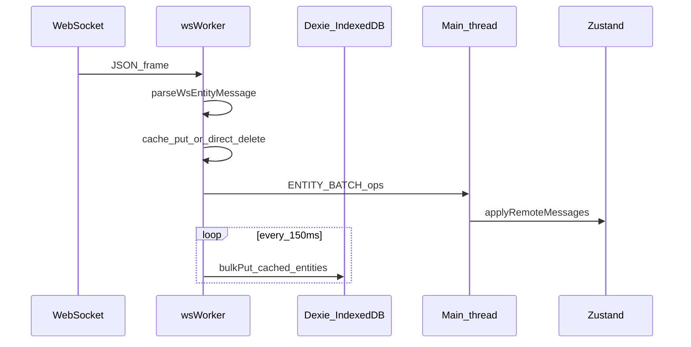

# Архитектура (справка для ИИ-агентов и разработчиков)

Документ описывает приложение **zustand-dixie**: **Web Worker + Dexie (IndexedDB) + Zustand**, строгий контракт **`WsEntityMessage`**, батчирование записи в БД и батчи на главный поток. Имя папки — историческое написание; библиотека — **Dexie.js**.

## Назначение

- **Назначение**: отражает архитектуру крупного QMS-клиента — сокет в worker, кэш + `bulkPut` в IndexedDB, зеркало коллекций в Zustand (с Redux DevTools в dev), без `any`.
- **Входы**: JSON по WebSocket (`entity`, `action`, `payload`); или `SEND_SIMULATED` с массивом сообщений; при старте — полная гидратация из Dexie.
- **Выходы**: синхронизированные `Record<id, Row>` по **23** сущностям в IndexedDB и в Zustand.

## Инварианты

1. **Справочник сущностей** — [`src/constants/entityNames.ts`](src/constants/entityNames.ts): `ENTITY_NAMES` и тип `EntityName`. Каждая строка **должна** иметь таблицу в [`src/db/schema.ts`](src/db/schema.ts) и поле в [`src/domain/entityRows.ts`](src/domain/entityRows.ts).
2. **Парсинг кадра** — [`parseWsEntityMessage`](src/domain/entityMessages.ts); после парсинга тип сообщения сужается по `entity` + `action`.
3. **Worker** ([`src/workers/wsWorker.ts`](src/workers/wsWorker.ts)): для `put` / `add` / `bulkPut` / `bulkAdd` данные попадают в **in-memory cache** и сбрасываются в Dexie каждые **150 ms**; `delete` / `query` — без кэша (delete сразу в таблицу).
4. **Главный поток**: воркер шлёт **`ENTITY_BATCH`** — массив `WsEntityMessage`, один вызов [`applyRemoteMessages`](src/store/entityStore.ts) применяет пачку через чистый редьюсер [`applyWsEntityMessages`](src/store/applyWsEntityMessage.ts) (микробатч `setTimeout(0)` на стороне воркера).
5. **Гидратация при загрузке приложения**: [`hydrateAllFromDb`](src/sync/hydrateAll.ts) читает все таблицы → Zustand (источник для UI после reload совпадает с тем же IndexedDB).
6. **Порядок на записи**: воркер пишет в Dexie и одновременно ставит сообщения в очередь на main; UI-стор обновляется из батчей (не ждать flush для отображения).

## Поток данных

## Карта файлов

| Область | Путь |
|---------|------|
| Имена сущностей | [`src/constants/entityNames.ts`](src/constants/entityNames.ts) |
| Строки таблиц | [`src/domain/entityRows.ts`](src/domain/entityRows.ts) |
| Действия WS | [`src/domain/wsActions.ts`](src/domain/wsActions.ts) |
| Сообщения | [`src/domain/entityMessages.ts`](src/domain/entityMessages.ts) |
| Чистый редьюсер | [`src/store/applyWsEntityMessage.ts`](src/store/applyWsEntityMessage.ts) |
| Zustand + devtools | [`src/store/entityStore.ts`](src/store/entityStore.ts) |
| Dexie схема | [`src/db/schema.ts`](src/db/schema.ts) |
| Пустые бакеты | [`src/db/emptyBuckets.ts`](src/db/emptyBuckets.ts) |
| Гидратация | [`src/sync/hydrateAll.ts`](src/sync/hydrateAll.ts) |
| Worker | [`src/workers/wsWorker.ts`](src/workers/wsWorker.ts) |
| Протокол postMessage | [`src/workers/wireTypes.ts`](src/workers/wireTypes.ts) |
| Хук моста | [`src/hooks/useWsBridge.ts`](src/hooks/useWsBridge.ts) |
| Демо-батч | [`src/dev/buildSimulatedBatch.ts`](src/dev/buildSimulatedBatch.ts) |

## Новая сущность (чеклист)

1. Добавить литерал в `ENTITY_NAMES` ([`entityNames.ts`](src/constants/entityNames.ts)).
2. Добавить тип строки в `EntityRowMap` ([`entityRows.ts`](src/domain/entityRows.ts)).
3. Добавить таблицу и строку `stores` в [`schema.ts`](src/db/schema.ts), **увеличить `version`** при миграции.
4. При необходимости — особая ветка в [`wsWorker.ts`](src/workers/wsWorker.ts) (как `calls` / `query_id` в монолите).
5. Перечитать доку и правила в [`.cursor/rules/zustand-dexie-state.mdc`](.cursor/rules/zustand-dexie-state.mdc).

## Большие объёмы

- Дефолтный кэш + `bulkPut` в worker — как в исходном `wsWorker`; для 10⁵+ строк сокращайте частоту обновлений UI: крупнее батчи `ENTITY_BATCH`, агрегаты на worker, не держите лишнее в Zustand.
- БД в шаблоне: `ZustandDixieArch` (версия схемы **2**), не предыдущий демо-`items`.

## Cursor / MCP

- Правила: [`.cursor/rules/`](.cursor/rules/).
- [`.cursor/mcp.json`](.cursor/mcp.json) — заготовка Context7.

## Скрипты

- `npm run dev` — Vite
- `npm run build` — `tsc --noEmit` + production
- `npm run lint` — ESLint (в т.ч. `no-explicit-any`: error)
